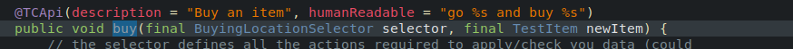
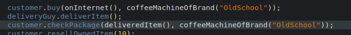
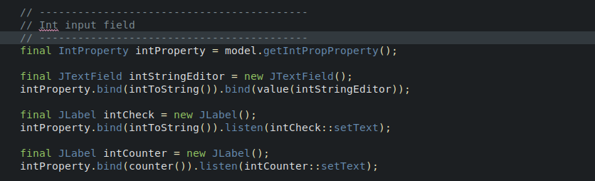

# Proof of concept repository
This repository contains some POCs I wrote during the years...

## Business oriented testing
This POC is about business oriented test writing (how to write test cases that are readable by both devs and business experts).  
[[Details here](testcase-writer)]

  

## GUI library
The testing POC is also used to test a MVC POC (to simplify the code of complex GUIs).   
[[Details here](skylib-java)]

There is a C++ version of the MVC POC (not up-to-date, not complete. Mostly another attempt to write some code in C++...)  
[[Details here](skylib-c++)]

## License
The code is under BSD 3 License.  
README.md inspired by [[PurpleBooth](https://gist.github.com/PurpleBooth)]

