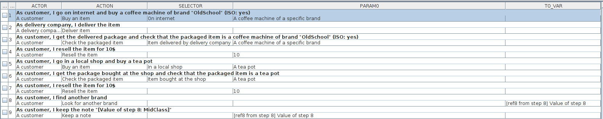

This repository contains some POCS I wrote during the years...

There is a POC about business oriented test writing (to write dev friendly and human readable tests).  
[[Check here for details about Test writer POC](testcase-writer)]

This POC is also used to test a MVC POC (to simplify the writing of complex GUIs).   
[[Check here for details about MVC POC](skylib-java)]

A C++ version of the MVC POC (not up-to-date, not complete... mostly an attempt to try C++ once again) : [[MVC POC](skylib-c++)]

