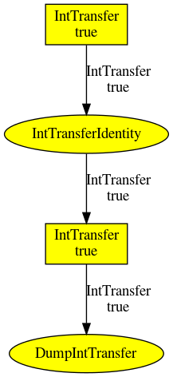

## Concepts

**Business oriented test concept**

The key to write business oriented test cases is to have an adapted test api
The concept is to have 
* Actors, each actor having a Role
* Role contains Actions
* Actions are made of
  * an action
  * a navigation operation
  * the action parameters (usually one, maybe two)
* Factories to creation navigation operations and action parameters

Example


_Api_ [[Code](testcase-writer/examples/src/main/java/ch/skymarshall/tcwriter/examples/api/interfaces)]

```java
@TCRole(description = "Customer")
public class CustomerTestRole extends Assert {
   ...

@TCApi(description = "Buy an item", stepSummary = "buy")

	public void buy(final BuyActionNavigator navigator, final TestItem newItem) {
		navigator.apply(testedService);
		testedService.buy(newItem.itemKind); // Then use application api
	}

	@TCApi(description = "check the delivered package", stepSummary = "checks that the delivered item is")
	public void checkPackage(final HandleActionNavigator navigator, final TestItem handledItem) {
		navigator.apply(testedService);
		assertEquals(testedService.getOwnedItem(), handledItem.itemKind); // Then use application api	
	} 
}

@TCApi(description = "how to buy an item", stepSummary = "how to buy an item", isNavigation = true)
public class BuyActionNavigator {

	private final Consumer<ExampleService> applier;

	public BuyActionNavigator(final Consumer<ExampleService> applier) {
		this.applier = applier;
	}

	@TCApi(description = "from internet", stepSummary = "from internet")
	public static BuyActionNavigator fromInternet() {
		return new BuyActionNavigator(svc -> svc.openBrowser()); // Use application api
	}
}


@TCApi(description = "the item you need", stepSummary = "an item")
public class TestItem {
...
	@TCApi(description = "a coffee machine", stepSummary = "a coffee machine")
	public static TestItem coffeeMachine() {
		...		
	}
...
}
```

_Java test case_ [[Code](testcase-writer/examples/src/test/java/ch/skymarshall/tcwriter/examples/SimpleTest.java)]

```java
CustomerTestRole customer = new CustomerTestRole(testedService); // Aka A customer
customer.buy(fromInternet(), coffeeMachine());
deliveryGuy.deliverItem(); // Another actor of the system
customer.checkPackage(deliveredItem(), coffeeMachine());
```
You can actually read

Actor | Action | Parameter | Navigator
----- | ------ | --------- | ---------
A customer     | buy an item                              | a coffee machine | from internet
A delivery guy | deliver an item                  | ||
A customer     | check that the delivered item is | a coffee machine |

This way of structuring the api should be suitable for
* writing test cases using some high level applications. That is, the application may allow the user to select (based on the data types)
  1. The Actor ("A customer")
  1. Based on the selected Actor's role, the Action "Buy an item"
  1. Based on the selected Action, the Navigator "from internet"
  1. Based on the selected Action, the parameter "a coffee machine"
* generating "readable" test reports

```
Step 1: As customer, I buy in a local shop: a coffee machine of brand: DeLuxeBrand
Step 2: As customer, I check that the packaged item is the item bought at the shop: a coffee machine of brand DeLuxeBrand
Step 3: As customer, I resell the item (in $): 10
Step 4: As customer, I find another brand
Step 5: As customer, I keep a note: another brand (from step 4)
```

* generating java test cases [[Code](testcase-writer/examples/src/test/java/ch/skymarshall/tcwriter/examples/MyTC.java)]

* storing the test in a "human readable" format (JSON, XML, ...) [[Code](testcase-writer/examples/src/main/resources/models)]

**Data flow management concept**

The idea is to provide tools to help keeping control of the software's structure

The concept is the following: 
* The description of the structure is based on the concept of flows
* A flow describes the structure of the information's exchange in the application 
* A service is basically structured the following way:
  * A data multiplexer receives different types of input data, which are multiplexed by an "input rule" to produce a data type supported by the service
  * At some point, the multiplexed data is sent to the service (aka the Action)
  * the output of the Action is de-multiplexed into many output data by the "output rule"
* The services are exchanging information through the input/output data
* The description of the system is written in a "human readable" language (json, xml, ...)
* Generators are used to 
  * Create the operational code
  * Create unit tests (to test the structure, using mock objects)
  * Create a visual description of the structure (eg dependency graphs using dot)
* The description of the structure may show the input/output data and actions used during a specific execution (test case or application) 

A simple flow would look like

 

(ellipses are services - or actions, boxes are data transfer types)
* json that describes the flow [[Json](dataflow-manager/data-flow-manager/examples/src/main/resources/data/simple-flow.json)]
* A test case [[Code](dataflow-manager/data-flow-manager/examples/src/test/java/ch/skymarshall/dataflowmgr/examples/DataFlowTest.java)] that is  
	1. loading the java flavor of the flow generated from the json file
	1. running a test case
	1. generating a json that contains the list of executed services
	1. generating an image showing all the actions/input rules/output rules
	1. it could generate an image showing the mismatches between the actions/input rules/output rules activated during the flow's execution and the expected ones   

**MVC concept**

Key points
* The Model is made of Properties (basically, a typed value and listeners)
* The dynamic properties of all the graphical components are always driven by properties
* The dynamic properties of the graphical components are never directly linked together 
* Properties of the model and properties of the graphical components are bound through converters
* The MVC model can be generated from the application model

Complete example [[Model](skylib-java/lib-hmi-examples/src/main/java/org/skymarshall/example/hmi/controller/impl/ControllerExampleModel.java)] [[View](skylib-java/lib-hmi-examples/src/main/java/org/skymarshall/example/hmi/controller/impl/ControllerExampleView.java)] 

Example

```java
protected final BooleanProperty booleanProperty = ...;

JCheckBox booleanEditor = new JCheckBox();
booleanProperty.bind(selected(booleanEditor));

JTextField stringEditor = new JTextField();
booleanProperty.bind(booleanToString()).bind(value(stringEditor));
```
Working with selections

_When propertyThatDrivesTheListValues is updated_
1. dynamicListSelectionProperty is detached from dynamicListSelectionEditor
1. dynamicListSelectionEditor is updated
1. dynamicListSelectionProperty is re-applied to restore the selection
1. dynamicListSelectionProperty is re-attached

```java
JList<String> dynamicListSelectionEditor = new JList<>();
ObjectProperty<String> propertyThatDrivesTheListValues = ... 
propertyThatDrivesTheListValues.bind(...some converter...).bind(values(dynamicListSelectionEditor));

ObjectProperty<String> dynamicListSelectionProperty = ...;
dynamicListSelectionProperty.bind(selection(dynamicListSelectionEditor)).addDependency(detachOnUpdateOf(propertyThatDrivesTheListValues)); 
```

**List Model**

Key points
* The list is always sorted (for fast search)
* The list can be filtered
* The list can be stacked (1 parent, many children) 
* startEditingValue(editedValue) must be called before editing the value (editedValue only containing the values required for sorting)
* stopEditingValue() must be called to validate the edition and propagate the change

Example [[Code](skylib-java/lib-hmi-java8/src/test/java/org/skymarshall/hmi/model/ListModelBasicTest.java)] [[Filters Example](skylib-java/lib-hmi-java8/src/test/java/org/skymarshall/hmi/model/FilterObjectModelTest.java)]

```java
IListView<TestObject> VIEW = ListViews.sorted((o1, o2) -> o1.val - o2.val);
ListModel<TestObject> model = new RootListModel<>(VIEW);
ListModel<TestObject> childModel = new ChildListModel<>(model);
TestObject toMove = new TestObject(4);
model.insert(new TestObject(1));
model.insert(new TestObject(3));
model.insert(toMove);
checkModel(childModel, 1, 3, 4);
model.startEditingValue(toMove);
toMove.val = 2;
model.stopEditingValue();
checkModel(childModel, 1, 2, 3);
```
Controlling filter using the MVC concept (TableModelExampleView.java)

```java
final DynamicView view = new DynamicView();
BooleanProperty reverseOrder = ...
reverseOrder.bind(selected(... some checkbox ...));
reverseOrder.bind(view.reverseOrder());
ListModel<TestObject> model = new RootListModel<>(ListViews.sorted(NORMAL_ORDER));
ListModel<TestObject> filteredModel = new ChildListModel<>(model, view);
```

**Table Model**

Key points
* The columns are defined by an Enum
* The model is a ListModel
* The column can have a fixed size or fill the size of the table
 
Model Example [[Model](skylib-java/lib-hmi-examples/src/main/java/org/skymarshall/example/hmi/TestObjectTableModel.java)] [[View](skylib-java/lib-hmi-examples/src/main/java/org/skymarshall/example/hmi/model/impl/TableModelExampleView.java)]

```java
public class TestObjectTableModel extends ListModelTableModel<TestObject, Columns> {

	public enum Columns { A_FIRST_VALUE, A_SECOND_VALUE	}
	
	public boolean isCellEditable(final int rowIndex, final int columnIndex) {
		return Columns.A_FIRST_VALUE.ordinal() == columnIndex;
	}

   	protected Object getValueAtColumn(final TestObject object, final Columns column) {
		switch (column) {
			case A_FIRST_VALUE: ...
```
Tuning columns

```java
final ContributionTableColumnModel<StepsTableModel.Column> columnModel = new ContributionTableColumnModel<>(table);
columnModel.install();
columnModel.configureColumn(ContributionTableColumn.fixedColumn(Column.STEP, 20, new DefaultTableCellRenderer()));
columnModel.configureColumn(ContributionTableColumn.fixedColumn(Column.ACTOR, 120, new DefaultTableCellRenderer()));
columnModel.configureColumn(ContributionTableColumn.gapColumn(...)); // Will fill the rest of the table 

Arrays.stream(Column.values()).forEach(c -> stepsTable.getColumn(c).setCellEditor(new Editor()));
```


