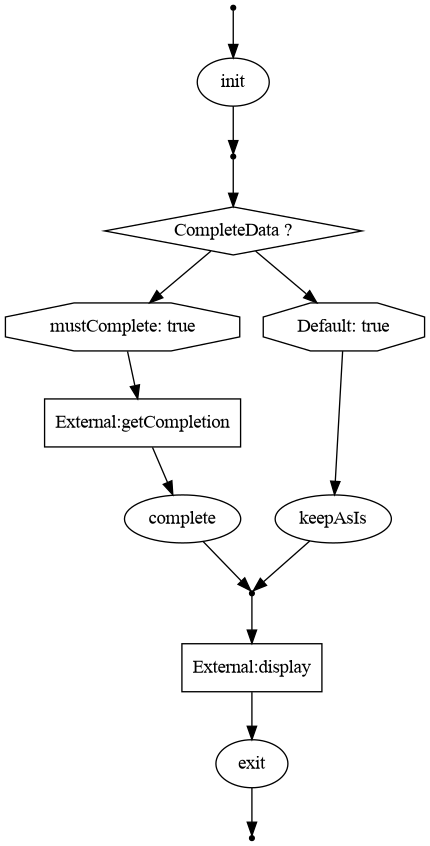

# Solving the complexity of a software (Work In Progress)
## A note
The current code does not match the following description.

## Abstract

It eventually happens, at some point in time, that the teams involved in a software development/maintenance are losing control of the software design. The reason  could be turnover, short deadlines, design issues, general complexity of the business/code, ...

## What is a software
A software is basically made of data (or a collection of...) and processing units (processors).
```
data -> processor -> data -> processor -> ...
```

**Data** are coming from external systems/services and are processed by processors. 
Data may be acquired asynchronously (input data) or synchronously (call to an external service - database, hardware, ...).
Data produced by the system are sent to an external service (database, hardware, ...)

**Processors** are pure functions that derivate new data from existing data.

The combination of data, processors and external systems are forming a data **flow**.
```                 
input data -> processor -> data [ + external data ] -> processor -> ... -> output data
```

In a traditional software, the procedures/methods/functions are taking the responsibility of loading durable data, processing all data and opportunistically triggering the subsequent processing. This approach is creating a hierarchy, which may become quite complex.

In a reactive software, the loading of the durable data are still performed by the processors, and each processor is still opportunistically triggering the subsequent processing. A complexity is added because of the difficulty to transfer a growing set of data from a processing to the next one
```
processor1(processorInput): myData=f_1(processorInput)
    return r(processor2(myData))...

processor2(processorInput): myData=f_2(processorInput)
    return r(processor2_part1(myData))
    .then(d -> combine(d, r(d -> externalInput(myData, d)))
    .then(d -> processor2_part2(myData, d))...
```

## The hierarchy issue
It is quite common to introduce bugs because no one really remembers which feature is calling some piece of code.
The consequence is, that at some point there is no sane way to identify the impact of that piece of code.

The reason is that reverse-engineering the call hierarchy is a complex task, and finding the conditions in which calls are performed are even more complex.

## Solving the hierarchy issue
A solution could be to use the data processing flow approach, as previously defined, and a more data-centric conception.

A flow is defined by 
* Processors, which are 
   * taking a set of data as parameters
   * producing a set of data (except for the last processor of the chain, which is only consuming data)
* External Adapters (to retrieve/push data from an external service, eg from a database)
* Flow controls, like
   * conditions, which are controlling which processor must be executed according to the current set of data
   * data splitters, which are splitting large amounts of data into smaller chunks

The flow implementations would be defined in a way that allows adequate visualization and testing.

## Example

The flow must be understood this way:
* The 'input data' are sent to the 'init' processor
* Depending of the 'Complete' conditions
   * if 'mustComplete', 'getCompletion' is called to retrieve data from an external system, then 'complete' processor is called
   * otherwise, the 'keepAsIs' processor is called
* The resulting data are then sent to the 'display' of an external system
* The flow is terminated




