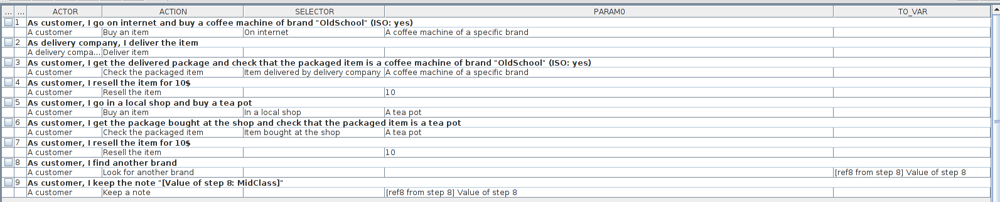
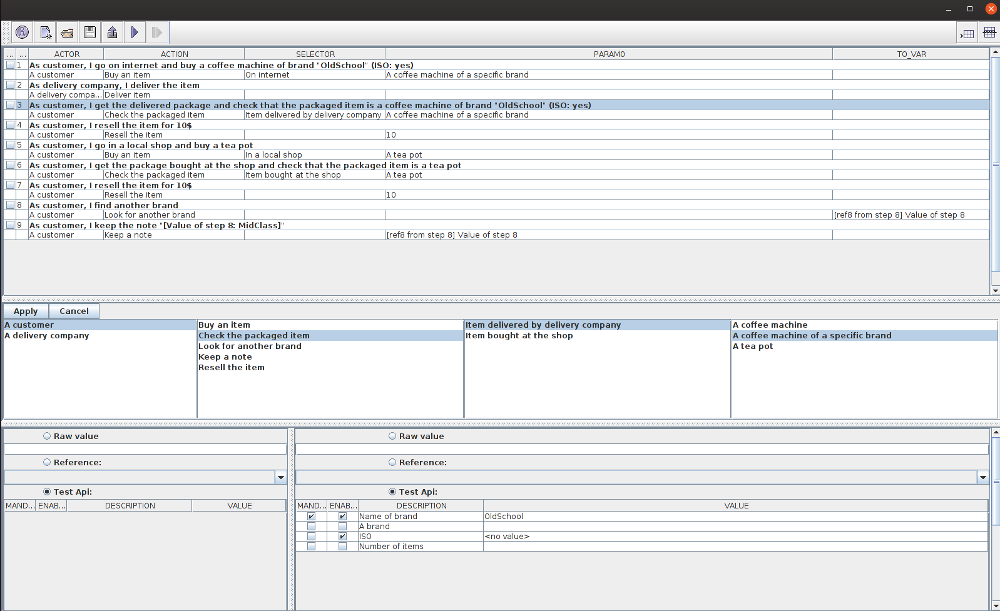

## Business oriented testing POC
The key to write business oriented test cases is to have adequate test APIs.

The idea is to have 
* Actors, each actor having a Role
* Each Role contains Actions
* Actions are made of
  * the Action itself
  * a Selection operation (aka Selector), used to select the element targeted by the action
  * the Action's Parameters 
* Factories, to create business oriented Selectors and Parameters

*Example*



# Actions/Selectors/Parameters

The Actions are methods defined by the Role classes.
The idea is to combine the Actions, Selectors and Parameters to perform many different operations.    
Some basic actions could be "edit", "check" and "delete"  
Some selectors could be "create", "find", "current"  
Let's consider that we have the data data1 and data2  
By combining the actions, we can

| Code                    | Meaning                                               |
|-------------------------|-------------------------------------------------------|
| edit(create(i1), data1) | Creates an item i1 and fills it using data1           |
| edit(current(), data2)  | Edits the selected item (i1) and fills it using data2 |
| edit(create(i2), data1) | Creates an item i2 and fills it using data1           |
| check(find(i1), data2)  | Checks that the content of i1 has data2               |
| check(find(i2), data1)  | Checks that the content of i2 has data1               |
| delete(find(i1))        | Deletes i1                                            |
| delete(find(i2))        | Deletes i2                                            |

[[Code](examples/src/main/java/ch/scaille/tcwriter/examples/api/interfaces)] / [[Testcase Writer Tests](gui-it/src/main/java/ch/scaille/tcwriter/it)]  
```java
@TCRole(description = "Customer")
public class CustomerTestRole extends Assert {
	
	@TCApi(description = "Buy an item", humanReadable = "go %s and buy %s")
	public void buy(final BuyingLocationSelector selector, final TestItem newItem) {
		...
	}

	@TCApi(description = "Check the packaged item", humanReadable = "get %s and check that the packaged item is %s")
	public void checkPackage(final PackageDeliverySelector selector, final TestItem handledItem) {
		...
	} 
	...
}
```
The Selectors and Parameters are created using factory methods, which have a business-oriented naming.   
The method parameters can be used to provide mandatory information.  
The setters of the factory's return type can be used to provide optional information.
```java
@TCApi(description = "delivery mean", humanReadable = "", isSelector = true)
public class PackageDeliverySelector {

	@TCApi(description = "Item delivered by delivery company", humanReadable = "the delivered package")
	public static PackageDeliverySelector deliveredItem() {
		... 
	}
	...
}


@TCApi(description = "an item you can buy", humanReadable = "")
public class TestItem {

	@TCApi(description = "A coffee machine", humanReadable = "a coffee machine")
	public static TestItem coffeeMachine() {
		...		
	}

	@TCApi(description = "Number of items", humanReadable = "count")
	public void setNumberOfItems(final int numberOfItems) {
		...
	}
	...
}
```
# Test api implementation
Test cases may target GUIs implemented using different technologies, such as Java Swing, web pages, ...

In general, the logic is still the same:
Until the action is performed,
1. find a GUI component
2. apply an action (click on a button, retrieve a text, ...)
It may be necessary to repeat both operations until the action is performed.

Some actions may trigger arbitrary events that are delaying the execution of the next action. The test case knows that an action is followed by such event, so the test case must memorize this event after the action is performed. The next action may then wait until the event is finished.

# Dev test cases 
Each Actor is an instance of a specific Role.  
by using the defined Roles/Actions/..., we can write test cases like
[[Code](examples/src/main/java/ch/scaille/tcwriter/examples/SimpleTest.java)]  
```java
CustomerTestRole customer = new CustomerTestRole(testedService); // A customer
...
customer.buy(onInternet(), coffeeMachine());
deliveryGuy.deliverItem(); // Another actor of the system
customer.checkPackage(deliveredItem(), coffeeMachine());
```

# Business expert test cases
We can transform the dev's test case into a more readable form by using the annotations attached to the Roles/Actions/Selectors/Parameters   

| Actor          | Action                           | Selector    | Parameter        |
|----------------|----------------------------------|-------------|------------------|
| A customer     | Buy an item                      | On internet | A coffee machine |
| A delivery guy | Deliver an item                  |             |                  |
| A customer     | Check that the delivered item is |             | A coffee machine |

This formalism should allow
* writing a test cases using a GUI based application. The application may allow the user to select (based on the actions' signature)
1. An Actor ("A customer")
2. Based on the selected Actor's Role, an Action ("Buy an item")
3. Based on the selected Action, a Selector ("On internet")
4. Based on the selected Action, a parameter ("A coffee machine")
  
* generating "readable" test reports (also based on the annotations attached to the Roles/Actions/Selectors/Parameters)

```
1. As customer, I go on internet and buy a coffee machine of brand "OldSchool" (ISO: yes)
2. As delivery company, I deliver the item
3. As customer, I get the delivered package and check that the packaged item is a coffee machine of brand "OldSchool" (ISO: yes)
4. As customer, I resell the item for 10$
5. As customer, I go in a local shop and buy a tea pot
6. As customer, I get the package bought at the shop and check that the packaged item is a tea pot
7. As customer, I resell the item for 10$
8. As customer, I find another brand
9. As customer, I keep the note "[Value of step 8: MidClass]"
```

* generating java test cases [[Code](examples/src/test/java/ch/scaille/tcwriter/examples/GeneratedTest.java)]

* storing the test in a "data description" format (JSON, XML, ...) [[Model](examples/src/main/resources/models/test-model.json)]  [[TestCase](examples/src/main/resources/testCase/testCase.json)]

# Demonstration GUI
A demonstration GUI is available here [[Code](examples/src/main/java/ch/scaille/tcwriter/examples/gui/ExampleTCEditor.java)]
  * The test model is automatically built by introspecting the java classes.
  * The test case is recorded from the execution of [[SimpleTest](examples/src/main/java/ch/scaille/tcwriter/examples/SimpleTest.java)] (thanks to AspectJ)
There is a basic web application version here: [[Code](webapp)]



**Testing the test case writer with business oriented tests**  
It's actually possible to test the GUI using this formalism.
[[Test infrastructure](gui-it/src/main/java/ch/scaille/tcwriter/it/)] [[TestCase](gui-it/src/test/java/ch/scaille/tcwriter/it/)]

