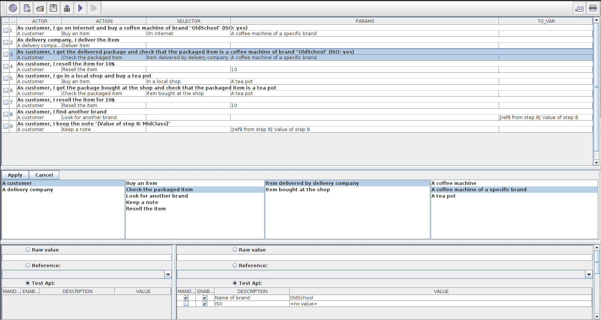

**Business oriented testing POC**
The key to write business oriented test cases is to have adequate test APIs.

The idea is to have 
* Actors, each actor having a Role
* Each Role contains Actions
* Those Actions are made of
  * The action itself
  * a Selection operation (a Selector, to select the element targeted by the Action)
  * the action's Parameters 
* Factories to create business oriented Selectors and Parameters

Example


_Api_ [[Code](examples/src/main/java/ch/skymarshall/tcwriter/examples/api/interfaces)]
The Actions are methods defined by the Role classes
```java
@TCRole(description = "Customer")
public class CustomerTestRole extends Assert {
	
	@TCApi(description = "Buy an item", humanReadable = "go %s and buy %s")
	public void buy(final BuyingLocationSelector selector, final TestItem newItem) {
		...
	}

	@TCApi(description = "Check the packaged item", humanReadable = "get %s and check that the packaged item is %s")
	public void checkPackage(final PackageDeliverySelector selector, final TestItem handledItem) {
		...
	} 
	...
}
```
The Selectors and Parameters are created though factory methods, which have business-oriented namings.  
The method parameters can be used to provide mandatory information.  
The setters of the type returned by the factory can be used to provide optional information.
```
@TCApi(description = "delivery mean", humanReadable = "", isSelector = true)
public class PackageDeliverySelector {

	@TCApi(description = "Item delivered by delivery company", humanReadable = "the delivered package")
	public static PackageDeliverySelector deliveredItem() {
		... 
	}
	...
}


@TCApi(description = "an item you can buy", humanReadable = "")
public class TestItem {

	@TCApi(description = "A coffee machine", humanReadable = "a coffee machine")
	public static TestItem coffeeMachine() {
		...		
	}

	@TCApi(description = "Number of items", humanReadable = "count")
	public void setNumberOfItems(final int numberOfItems) {
		...
	}
	...
}
```

_Java test case_ [[Code](examples/src/main/java/ch/skymarshall/tcwriter/examples/SimpleTest.java)]

Each Actor is an instance of a specific Role
```java
CustomerTestRole customer = new CustomerTestRole(testedService); // Aka A customer
...
customer.buy(onInternet(), coffeeMachine());
deliveryGuy.deliverItem(); // Another actor of the system
customer.checkPackage(deliveredItem(), coffeeMachine());
```
Based on the annotations attached to the Roles/Actions/Selectors/Parameters, we can actually read

Actor | Action | Selector | Parameter
----- | ------ | --------- | ---------
A customer     | Buy an item                              | On internet| A coffee machine 
A delivery guy | Deliver an item                  | ||
A customer     | Check that the delivered item is || A coffee machine |

This way of structuring the api should be suitable for
* writing test cases using some GUI based application. That is, the application may allow the user to select (based on the data types)
  1. The Actor ("A customer")
  1. Based on the selected Actor's Role, the Action "Buy an item"
  1. Based on the selected Action, the Selector "On internet"
  1. Based on the selected Action, the parameter "A coffee machine"
* generating "readable" test reports (also based on the annotations attached to the Roles/Actions/Selectors/Parameters)

```
1. As customer, I go on internet and buy a coffee machine of brand "OldSchool" (ISO: yes)
2. As delivery company, I deliver the item
3. As customer, I get the delivered package and check that the packaged item is a coffee machine of brand "OldSchool" (ISO: yes)
4. As customer, I resell the item for 10$
5. As customer, I go in a local shop and buy a tea pot
6. As customer, I get the package bought at the shop and check that the packaged item is a tea pot
7. As customer, I resell the item for 10$
8. As customer, I find another brand
9. As customer, I keep the note "[Value of step 8: MidClass]"
```

* generating java test cases [[Code](examples/src/test/java/ch/skymarshall/tcwriter/examples/GeneratedTest.java)]

* storing the test in a "data description" format (JSON, XML, ...) [[Model](examples/src/main/resources/models/test-model.json)]  [[TestCase](examples/src/main/resources/testCase/testCase.json)]

* A demonstration GUI is available here [[Code](examples/src/main/java/ch/skymarshall/tcwriter/examples/gui/ExampleTCEditor.java)]
  * The test model is automatically built by introspecting the java classes.
  * The testcase is recorded from the execution of [[SimpleTest](examples/src/main/java/ch/skymarshall/tcwriter/examples/SimpleTest.java)] (thanks to AspectJ)



_Testing the test case writer with business oriented tests_
They are some test cases to test the GUI...  (work in progress)
[[Test infrastructure](gui-it/src/main/java/ch/skymarshall/tcwriter/it/)] [[TestCase](gui-it/src/test/java/ch/skymarshall/tcwriter/it/)]

